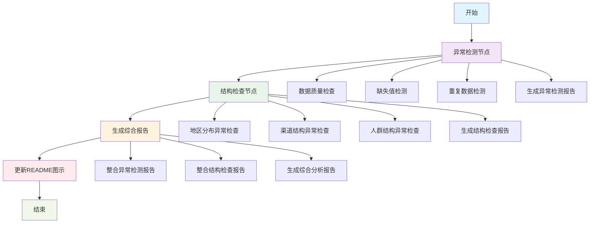

# W35 异常检测工作流

## 工作流架构



## 功能说明

### 异常检测节点
- 文件存在性检查
- 数据读取验证
- 基本统计信息收集
- 缺失值检测与分析
- 重复数据检测
- 数据类型分布分析
- 异常值识别

### 结构检查节点
- 地区分布异常检测：对比CM2车型与历史车型的地区订单分布变化
- 渠道结构异常检测：分析各渠道销量占比的突变情况
- 人群结构异常检测：检测性别比例和年龄段结构的大幅变化
- 基于业务定义的时间范围进行数据筛选

### 综合报告生成
- 整合异常检测和结构检查结果
- 提供数据质量和结构异常的综合评估
- 基于检测结果提供相应的处理建议

### 报告生成
- 自动生成详细的MD格式异常检测报告
- 生成结构检查报告
- 生成综合分析报告
- 包含数据质量评级
- 提供可视化的异常统计信息

### 工作流特性
- 基于LangGraph框架构建
- 模块化节点设计
- 多维度异常检测（数据质量+业务结构）
- 完整的错误处理机制
- 详细的日志记录

## 使用方法

```bash
# 激活虚拟环境
source .venv/bin/activate

# 运行异常检测工作流
python main.py
```

## 输出文件
- `anomaly_detection_report.md`: 详细的异常检测报告
- `structure_check_report.md`: 结构检查详细报告
- `complete_analysis_report.md`: 综合分析报告
- 控制台日志: 实时处理状态信息

## 配置文件
- `business_definition.json`: 业务时间范围定义，用于结构检查的数据筛选
