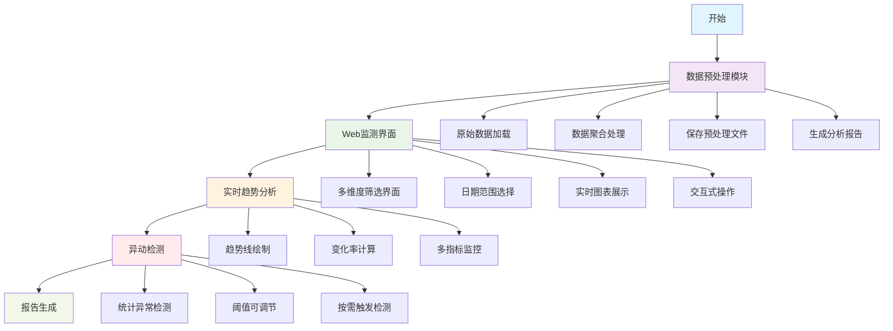

# W35 汽车销量监测系统

## 系统架构



## 功能说明

### 数据预处理模块 (order_trend_monitor.py)
- **原始数据加载**: 从Parquet文件读取汽车订单观察数据
- **数据聚合处理**: 使用DuckDB进行高效的SQL聚合计算
- **多维度聚合**: 按日期、区域、省份、渠道维度聚合订单数据
- **指标计算**: 计算订单数、小订数、锁单数、开票价格、退订数等关键指标
- **预处理文件生成**: 将聚合结果保存为processed_order_data.parquet文件
- **数据结构分析**: 生成详细的数据质量和结构分析报告

### Web监测界面 (order_monitor.py)
- **快速启动**: 从预处理文件加载数据，避免重复聚合计算
- **多维度筛选**: 支持区域、省份、渠道的联动选择
- **指标监控**: 监测订单量、小订量、锁单量、成交均价、退订量等核心指标
- **日期范围选择**: 支持自定义时间范围的数据分析
- **实时图表**: 使用Plotly生成交互式趋势图表
- **变化率计算**: 自动计算并显示指标的环比变化率

### 异动检测功能
- **统计异常检测**: 基于Z-Score方法识别数据异常点
- **可调节阈值**: 支持用户自定义异常检测的敏感度
- **按需检测**: 通过按钮触发异动检测，避免频繁计算
- **多维度异常**: 支持不同区域、渠道、指标的独立异常检测

### 技术特性
- **高性能数据处理**: 使用DuckDB内存数据库进行快速SQL查询
- **Web界面**: 基于Gradio构建的现代化Web界面
- **交互式可视化**: 使用Plotly生成动态图表
- **模块化设计**: 数据处理与界面展示分离
- **优化的数据流**: 预处理文件避免重复计算
- **容错性强**: 完善的错误处理和日志记录

## 使用方法

### 1. 数据预处理
```bash
# 运行数据预处理，生成聚合数据文件
python order_trend_monitor.py
```

### 2. 启动监测界面
```bash
# 启动Web监测界面
python order_monitor.py
```

### 3. 访问界面
打开浏览器访问: http://127.0.0.1:7860

## 数据文件
- **输入文件**: `汽车订单观察数据.parquet` - 原始订单数据
- **预处理文件**: `processed_order_data.parquet` - 聚合后的数据
- **分析报告**: `订单趋势线监测报告.md` - 数据质量分析报告

## 系统要求
- Python 3.8+
- DuckDB
- Gradio
- Plotly
- Polars
- 其他依赖见requirements.txt

## 核心优势

### 性能优化
- **预处理机制**: 通过预先聚合数据，避免每次启动时重复计算
- **内存数据库**: 使用DuckDB实现高速数据查询和分析
- **增量加载**: 支持从预处理文件快速加载数据

### 用户体验
- **直观界面**: 现代化的Web界面，操作简单直观
- **实时反馈**: 图表和数据实时更新，响应迅速
- **灵活筛选**: 多维度筛选条件，满足不同分析需求
- **按需检测**: 异动检测按钮触发，避免不必要的计算

### 数据洞察
- **多指标监控**: 全面监控订单量、成交价格、退订率等关键指标
- **趋势分析**: 清晰展示各指标的时间趋势和变化模式
- **异常识别**: 智能识别数据异常点，及时发现业务问题
- **环比分析**: 自动计算变化率，快速识别增长或下降趋势

## 项目结构
```
W35_workflow/
├── order_trend_monitor.py    # 数据预处理模块
├── order_monitor.py          # Web监测界面
├── 汽车订单观察数据.parquet    # 原始数据文件
├── processed_order_data.parquet # 预处理数据文件
├── 订单趋势线监测报告.md       # 数据分析报告
└── README.md                 # 项目说明文档
```
